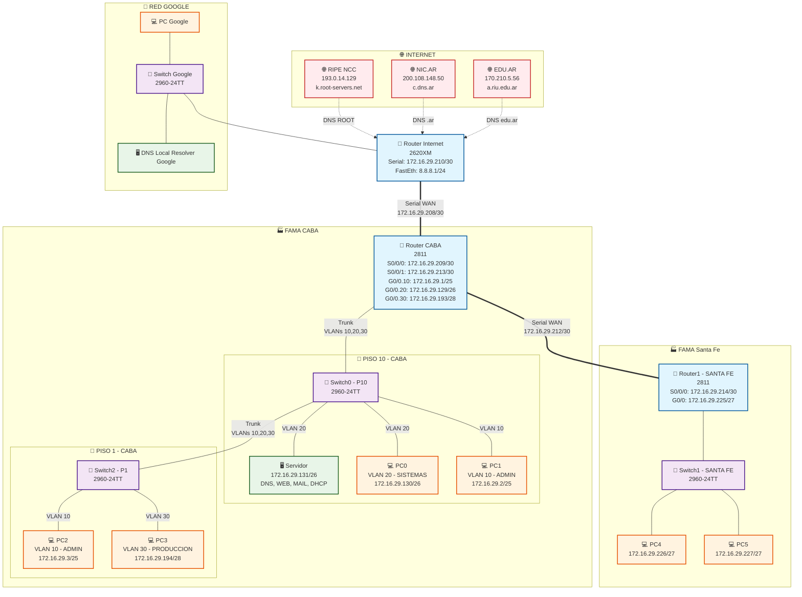
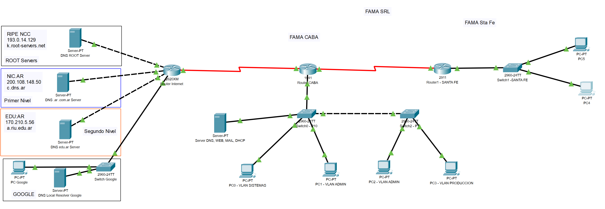

# Proyecto Final - Redes
Zader, Javier Norberto
28 de julio de 2025

## Resumen

Este informe presenta el diseño e implementación completa de la
infraestructura de red para Fábrica Argentina de Máquinas Agrarias (FAMA
SRL). El proyecto integra exitosamente dos sedes geográficamente
distribuidas (CABA y Santa Fe) mediante tecnologías de red modernas,
incluyendo VLANs, enrutamiento estático, NAT/PAT, y servicios
centralizados de DNS, DHCP, Web y correo electrónico.

## Introducción y Marco Teórico

### Objetivo del Proyecto

Diseñar e implementar una infraestructura de red empresarial que
satisfaga los requerimientos de conectividad, seguridad y servicios de
FAMA SRL, cumpliendo con las mejores prácticas de la industria.

### Parámetros Principales

| Parámetro             | Valor                                             |
|-----------------------|---------------------------------------------------|
| **Empresa**           | Fábrica Argentina de Máquinas Agrarias (FAMA SRL) |
| **Dominio**           | fama.com.ar                                       |
| **Bloque IP Privado** | 172.16.29.0/24                                    |
| **Bloque IP Público** | 200.45.110.128/25                                 |
| **Sedes**             | CABA (principal) y Santa Fe                       |
| **Tecnologías**       | VLANs, NAT/PAT, DHCP, DNS, Enrutamiento Estático  |

### Marco Teórico

#### VLANs (Virtual Local Area Networks)

Las VLANs permiten la segmentación lógica de la red a nivel de capa 2,
proporcionando aislamiento de tráfico, mejor gestión de broadcast
domains y implementación de políticas de seguridad diferenciadas por
departamento.

#### NAT/PAT (Network Address Translation/Port Address Translation)

Tecnología que permite el mapeo entre direcciones IP privadas y
públicas, optimizando el uso de direcciones IPv4 públicas y
proporcionando una capa adicional de seguridad.

#### VLSM (Variable Length Subnet Masking)

Técnica de subneteo que permite el uso eficiente del espacio de
direcciones IP mediante la asignación de máscaras de subred de
diferentes longitudes según los requerimientos específicos de cada
segmento.

## Análisis de Requerimientos

### Estructura Organizacional

#### Sede CABA

- **Edificio:** 10 pisos (FAMA ocupa pisos 1° y 10°)
- **Piso 10:** Centro de Datos, Sistemas (38 hosts), Gerencia (10),
  Ingeniería (30), RR.HH. (6), Contabilidad (15)
- **Piso 1:** Ingeniería (15), Gestión y Producción (5), RR.HH. (4)

#### Sede Santa Fe

- **Edificio:** 2 pisos (propiedad completa de FAMA)
- **Piso 1:** Producción (10), Logística (5), Comercial (3)
- **Piso 2:** Administración (4), Cuarto de Servidores (6 servidores)

### Requerimientos de Segmentación

#### CABA - Segmentación por VLANs

1.  **VLAN 10 (Administración):** Ventas, Contabilidad, Ingeniería,
    RR.HH., Gerencia
2.  **VLAN 20 (Sistemas):** Departamento de Sistemas y Centro de Datos  
3.  **VLAN 30 (Producción):** Gestión y Producción

#### Santa Fe - Red Única

Red unificada sin segmentación por VLANs debido al menor tamaño y
complejidad organizacional.

### Conteo de Hosts por Subred

| Ubicación | Departamento | Hosts Requeridos | Hosts Dimensionados |
|----|----|----|----|
| **CABA VLAN 10** | Admin/Ventas/Contab./Ing./RR.HH./Ger. | 74 | 126 (/25) |
| **CABA VLAN 20** | Sistemas + Servidores | 58 | 62 (/26) |
| **CABA VLAN 30** | Gestión y Producción | 5 | 14 (/28) |
| **Santa Fe** | Todos los departamentos | 22 | 30 (/27) |

## Diseño de Capa Física

### Topología de Red

La red implementa una topología jerárquica de tres capas:
- **Capa de Núcleo:** Router CABA como punto central de enrutamiento
- **Capa de Distribución:** Switches con capacidad de VLANs  
- **Capa de Acceso:** Puertos de switch conectados a dispositivos
finales

### Cableado Estructurado

#### CABA

- **Backbone Vertical:** Fibra óptica entre pisos para aislamiento
  galvánico
- **Cableado Horizontal:** Cat 6 con terminaciones RJ45
- **Patch Panels:** Organizados por VLAN y departamento

#### Santa Fe

- **Cableado:** Cat 6 con distribución centralizada
- **Topología:** Estrella simple sin VLANs

### Equipamiento de Red

| Dispositivo     | Modelo  | Ubicación   | Función                             |
|-----------------|---------|-------------|-------------------------------------|
| Router Internet | 2811    | Externo     | Gateway Internet                    |
| Router CABA     | 2811    | CABA P10    | Router principal con sub-interfaces |
| Router Santa Fe | 2811    | Santa Fe P2 | Gateway local                       |
| Switch0-P10     | 2960    | CABA P10    | Switch principal con VLANs          |
| Switch2-P1      | 2960    | CABA P1     | Switch acceso con VLANs             |
| Switch1-SantaFe | 2960    | Santa Fe    | Switch acceso simple                |
| Servidor        | Generic | CABA P10    | DNS, WEB, MAIL, DHCP                |

## Diseño de Capa de Enlace

### Esquema de VLANs

    VLAN 10 - Administración
    ├── Ventas
    ├── Contabilidad  
    ├── Ingeniería
    ├── RR.HH.
    └── Gerencia

    VLAN 20 - Sistemas
    ├── Depto. Sistemas
    ├── Centro de Datos
    └── Servidores

    VLAN 30 - Producción
    └── Gestión y Producción

### Configuración de Switches

#### Switch Principal (Switch0-P10)

> [!NOTE]
>
> ### Configuración Switch Principal
>
> ``` cisco
> vlan 10
>  name ADMIN
> vlan 20  
>  name SISTEMAS
> vlan 30
>  name PRODUCCION
>
> ! Puertos de acceso
> interface fa0/1
>  switchport access vlan 20
>  description Servidor-Principal
>
> interface fa0/2
>  switchport access vlan 20  
>  description PC-Sistemas
>
> ! Puerto troncal hacia router
> interface gig0/1
>  switchport mode trunk
>  switchport trunk allowed vlan 10,20,30
> ```

### Protocolo 802.1Q

Implementación de IEEE 802.1Q para el transporte de múltiples VLANs a
través de enlaces troncales, permitiendo la separación lógica del
tráfico entre departamentos.

## Diseño de Capa de Red

### Esquema de Subneteo VLSM

Aplicación de Variable Length Subnet Masking para optimización del
espacio de direcciones:

| Subred | Red | Máscara | Rango Hosts | Gateway | Broadcast | Capacidad |
|----|----|----|----|----|----|----|
| **VLAN 10** | 172.16.29.0/25 | 255.255.255.128 | .1 – .126 | .1 | .127 | 126 hosts |
| **VLAN 20** | 172.16.29.128/26 | 255.255.255.192 | .129 – .190 | .129 | .191 | 62 hosts |
| **VLAN 30** | 172.16.29.192/28 | 255.255.255.240 | .193 – .206 | .193 | .207 | 14 hosts |
| **Santa Fe** | 172.16.29.224/27 | 255.255.255.224 | .225 – .254 | .225 | .255 | 30 hosts |
| **WAN CABA-Int** | 172.16.29.208/30 | 255.255.255.252 | .209 – .210 | — | .211 | 2 hosts |
| **WAN CABA-SF** | 172.16.29.212/30 | 255.255.255.252 | .213 – .214 | — | .215 | 2 hosts |

### Ruteo Estático

#### Router CABA - Configuración Principal

> [!TIP]
>
> ### Configuración Router CABA
>
> ``` cisco
> ! Sub-interfaces para VLANs
> interface gig0/0.10
>  encapsulation dot1q 10
>  ip address 172.16.29.1 255.255.255.128
>
> interface gig0/0.20
>  encapsulation dot1q 20  
>  ip address 172.16.29.129 255.255.255.192
>
> interface gig0/0.30
>  encapsulation dot1q 30
>  ip address 172.16.29.193 255.255.255.240
>
> ! Rutas estáticas
> ip route 0.0.0.0 0.0.0.0 172.16.29.210          ! Ruta por defecto
> ip route 172.16.29.224 255.255.255.224 172.16.29.214  ! Hacia Santa Fe
> ```

### NAT/PAT Implementation

#### NAT Dinámico (PAT)

> [!IMPORTANT]
>
> ### Configuración NAT/PAT
>
> ``` cisco
> access-list 1 permit 172.16.29.0 0.0.0.255
> ip nat pool FAMA_POOL 200.45.110.130 200.45.110.254 netmask 255.255.255.128
> ip nat inside source list 1 pool FAMA_POOL overload
> ```

#### NAT Estático para Servicios

> [!WARNING]
>
> ### NAT Estático 1:1
>
> ``` cisco
> ip nat inside source static 172.16.29.131 200.45.110.129
> ```

**Ventajas del NAT estático 1:1:** 
- Mapeo completo de todos los puertos del servidor
- Simplifica la configuración para múltiples servicios
- Facilita el troubleshooting

## Servicio DHCP

### Arquitectura DHCP Centralizada

El servicio DHCP se implementa de forma centralizada en el servidor
principal (172.16.29.131), con routers actuando como DHCP Relay Agents
mediante `ip helper-address`.

### Configuración de Pools DHCP

| Pool              | VLAN | Rango IP          | Gateway       | DNS           | Máscara |
|-------------------|------|-------------------|---------------|---------------|---------|
| VLAN10_ADMIN      | 10   | 172.16.29.10-120  | 172.16.29.1   | 172.16.29.131 | /25     |
| VLAN20_SISTEMAS   | 20   | 172.16.29.140-185 | 172.16.29.129 | 172.16.29.131 | /26     |
| VLAN30_PRODUCCION | 30   | 172.16.29.200-205 | 172.16.29.193 | 172.16.29.131 | /28     |
| SANTAFE           | —    | 172.16.29.230-250 | 172.16.29.225 | 172.16.29.131 | /27     |

### DHCP Relay Configuration

> [!NOTE]
>
> ### Configuración DHCP Relay
>
> ``` cisco
> ! En Router CABA
> interface gig0/0.10
>  ip helper-address 172.16.29.131
>
> interface gig0/0.20
>  ip helper-address 172.16.29.131
>
> interface gig0/0.30  
>  ip helper-address 172.16.29.131
>
> ! En Router Santa Fe
> interface gig0/0
>  ip helper-address 172.16.29.131
> ```

## Servicios de Capa de Aplicación

### Servicio DNS

#### Arquitectura DNS Implementada

El servidor DNS tiene una configuración unificada que funciona tanto
para acceso interno como externo, simplificando la administración y
garantizando consistencia en la resolución de nombres.

> [!IMPORTANT]
>
> ### 📋 Configuración DNS Implementada
>
> La siguiente tabla muestra los registros DNS exactos configurados en
> el servidor:
>
> | **Registro** | **Nombre** | **Tipo** | **Destino** | **Propósito** |
> |:--:|----|----|----|----|
> | **0** | `.` | NS | k.root-servers.net | Delegación al servidor raíz |
> | **1** | dns.fama.com.ar | A Record | **200.45.110.129** | Servidor DNS principal |
> | **2** | fama.com.ar | NS | dns.fama.com.ar | Delegación del dominio |
> | **3** | k.root-servers.net | A Record | 193.0.14.129 | Dirección del servidor raíz |
> | **4** | mail.fama.com.ar | A Record | **200.45.110.129** | Servidor de correo |
> | **5** | servidor.fama.com.ar | A Record | **200.45.110.129** | Servidor principal |
> | **6** | www.fama.com.ar | CNAME | servidor.fama.com.ar | Alias para sitio web |

#### Análisis Técnico de la Configuración

> [!TIP]
>
> ### 🔍 Ventajas de la Implementación Unificada
>
> **1. Simplicidad Administrativa**
> - Un solo conjunto de registros DNS para mantener
> - Eliminación de inconsistencias entre resolución interna/externa
> - Menor complejidad operacional
>
> **2. Funcionalidad Dual**
> - **Acceso Interno:** Los clientes internos resuelven a 200.45.110.129
> - **Acceso Externo:** Los clientes de Internet resuelven a la misma IP
> - **Traducción NAT:** El router CABA traduce automáticamente 200.45.110.129 → 172.16.29.131
>
> **3. Escalabilidad**
> - Facilita la adición de nuevos servicios
> - Preparado para futuras expansiones
> - Compatible con CDNs y balanceadores de carga externos

#### Flujo de Resolución DNS

La jerarquía DNS implementada sigue el estándar de Internet:

1.  **DNS ROOT Server** → Deriva consultas `.ar` hacia `c.dns.ar`
2.  **DNS .ar .com.ar Server** → Deriva `fama.com.ar` hacia
    `servidor.fama.com.ar`  
3.  **DNS FAMA Server** → Responde con los registros específicos (IP
    pública)
4.  **NAT Estático** → Traduce automáticamente la IP pública a la
    privada

> [!NOTE]
>
> ### 💡 Nota Técnica Importante
>
> Todos los registros DNS apuntan exclusivamente a la **IP pública**
> (200.45.110.129). Esta decisión arquitectónica:
>
> - **Simplifica** la configuración DNS
> - **Garantiza** funcionamiento tanto interno como externo  
> - **Centraliza** la traducción de direcciones en el NAT estático
> - **Elimina** la necesidad de DNS “split-horizon” o dual
>
> La traducción NAT estática 1:1 maneja transparentemente el mapeo hacia
> el servidor real (172.16.29.131).

#### Jerarquía DNS Externa

La implementación del sistema DNS externo sigue la estructura jerárquica
estándar de Internet, permitiendo que el dominio **fama.com.ar** sea
accesible desde cualquier ubicación en Internet.

> [!NOTE]
>
> ### 🌐 Estructura Jerárquica DNS
>
> **Nivel 1: DNS ROOT Servers**
> - Servidor raíz que maneja las consultas iniciales
> - Deriva consultas `.ar` hacia los servidores de dominio nacional
>
> **Nivel 2: DNS .ar .com.ar Server (NIC.AR)**
> - Servidor autoritativo para el dominio `.com.ar`
> - IP: 200.108.148.50 - Deriva consultas específicas de **fama.com.ar** hacia el servidor de FAMA
>
> **Nivel 3: DNS FAMA Server**
> - Servidor autoritativo final para **fama.com.ar**
> - IP: 200.45.110.129 (IP pública de FAMA)
> - Responde con los registros específicos del dominio

#### Configuración de Delegación

Para que el dominio **fama.com.ar** sea resuelto desde Internet, se
implementó una configuración de delegación DNS siguiendo los estándares
internacionales.

> [!IMPORTANT]
>
> ### ⚙️ Registros de Delegación Configurados
>
> ### 📍 **En DNS .ar .com.ar Server (NIC.AR)**
>
> | Registro | Tipo | Destino | Propósito |
> |----|----|----|----|
> | `fama.com.ar` | **NS** | `servidor.fama.com.ar` | Delegación del dominio |
> | `servidor.fama.com.ar` | **A** | `200.45.110.129` | Dirección del servidor DNS |
>
> ### 📍 **En DNS ROOT Server**
>
> | Registro   | Tipo   | Destino          | Propósito                     |
> |------------|--------|------------------|-------------------------------|
> | `.ar`      | **NS** | `c.dns.ar`       | Delegación nacional Argentina |
> | `c.dns.ar` | **A**  | `200.108.148.50` | Servidor DNS Argentina        |

> [!TIP]
>
> ### 🔄 Flujo de Resolución Completo
>
> **Consulta:** `www.fama.com.ar` desde Internet
>
> 1.  **Cliente** → **DNS Root Server**: “¿Quién maneja `.ar`?”
> 2.  **Root Server** → **Cliente**: “Consulta a `c.dns.ar`
>     (200.108.148.50)”
> 3.  **Cliente** → **DNS .ar Server**: “¿Quién maneja `fama.com.ar`?”
> 4.  **DNS .ar Server** → **Cliente**: “Consulta a
>     `servidor.fama.com.ar` (200.45.110.129)”
> 5.  **Cliente** → **DNS FAMA**: “¿Cuál es la IP de `www.fama.com.ar`?”
> 6.  **DNS FAMA** → **Cliente**: “200.45.110.129”
> 7.  **NAT Router CABA**: Traduce automáticamente 200.45.110.129 →
>     172.16.29.131

**Resultado:** Esta configuración garantiza que cualquier consulta DNS
externa pueda encontrar y acceder exitosamente a los servicios de FAMA
SRL, manteniendo la compatibilidad total con los estándares de Internet.

### Servicio Web (HTTP)

- **Servidor:** Apache en puerto 80
- **Contenido:** Información corporativa de FAMA SRL
- **Acceso:** Interno y externo vía NAT estático
- **URL:** http://www.fama.com.ar

### 7.3 Servicio de Correo Electrónico

#### Configuración del Servidor

- **Protocolos:** SMTP (puerto 25), POP3 (puerto 110)
- **Dominio:** fama.com.ar
- **Usuarios configurados:**
  - admin@fama.com.ar (VLAN Admin)
  - sistemas@fama.com.ar (VLAN Sistemas)
  - produccion@fama.com.ar (VLAN Producción)  
  - santafe@fama.com.ar (Sede Santa Fe)

#### Configuración de Clientes

La configuración de clientes de correo en cada PC sigue un estándar
unificado que garantiza la conectividad con el servidor central de FAMA.

> [!NOTE]
>
> ### 📧 Parámetros de Configuración Estándar
>
> ### 🔧 **Configuración General**
>
> | Parámetro                    | Valor              | Descripción              |
> |------------------------------|--------------------|--------------------------|
> | **Servidor Entrante (POP3)** | `172.16.29.131`    | Puerto 110               |
> | **Servidor Saliente (SMTP)** | `172.16.29.131`    | Puerto 25                |
> | **Dominio de correo**        | `@fama.com.ar`     | Dominio corporativo      |
> | **Autenticación**            | Usuario/Contraseña | Credenciales específicas |

> [!TIP]
>
> ### 👥 Configuración por Usuario y Ubicación
>
> ### **VLAN 10 - Administración**
>
> - **Usuario:** `admin@fama.com.ar`
> - **Credenciales:** admin / admin123
> - **Ubicación:** PC1, PC2 (CABA)
>
> ### **VLAN 20 - Sistemas**
>
> - **Usuario:** `sistemas@fama.com.ar`
> - **Credenciales:** sistemas / sistemas123
> - **Ubicación:** PC0 (CABA)
>
> ### **VLAN 30 - Producción**
>
> - **Usuario:** `produccion@fama.com.ar`
> - **Credenciales:** produccion / produccion123
> - **Ubicación:** PC3 (CABA)
>
> ### **Sede Santa Fe**
>
> - **Usuario:** `santafe@fama.com.ar`
> - **Credenciales:** santafe / santafe123
> - **Ubicación:** PC4, PC5 (Santa Fe)

> [!IMPORTANT]
>
> ### ⚙️ Configuración Técnica Detallada
>
> **Paso a paso para configurar cliente de correo:**
>
> 1.  **Abrir cliente de correo** en Desktop de la PC
> 2.  **Configurar datos personales:**
>     - Nombre: \[Nombre del departamento\]
>     - Email: \[usuario\]@fama.com.ar
> 3.  **Configurar servidores:**
>     - Servidor entrante: 172.16.29.131
>     - Servidor saliente: 172.16.29.131
> 4.  **Autenticación:**
>     - Usuario: \[sin @fama.com.ar\]
>     - Contraseña: \[según tabla anterior\]
> 5.  **Verificar conectividad** enviando email de prueba

**Resultado:** Esta configuración permite intercambio de correos entre
todas las VLANs y sedes, facilitando la comunicación corporativa
unificada a través del servidor centralizado en CABA.

## Implementación y Emulación

### Plataforma de Emulación

**Software:** Cisco Packet Tracer  
**Versión:** Campus Virtual UGD  
**Escala:** Red reducida representativa con todos los servicios
funcionales

### Dispositivos Implementados

- **3 Routers Cisco 2811** (Internet, CABA, Santa Fe)
- **3 Switches Cisco 2960** (2 en CABA, 1 en Santa Fe)  
- **1 Servidor Generic** (DNS, WEB, MAIL, DHCP)
- **6 PCs de prueba** (distribuidas en VLANs y sedes)

### Topología Final



**Figura 1.** Topología completa de la red FAMA SRL implementada en
Packet Tracer, mostrando la conectividad externa hacia Internet, los
servidores DNS jerárquicos, la interconexión WAN entre sedes, y la
segmentación por VLANs en la sede CABA.

## Pruebas y Verificación

### Pruebas de Conectividad

#### Conectividad Inter-VLAN

``` bash
# Desde PC VLAN 10 hacia VLAN 20
ping 172.16.29.130    ✓ Exitoso

# Desde PC VLAN 30 hacia Santa Fe  
ping 172.16.29.226    ✓ Exitoso
```

#### Conectividad hacia Internet

``` bash
# Desde cualquier PC interno
ping 8.8.8.1         ✓ Exitoso
```

### Pruebas de Servicios

#### DNS Resolution

``` bash
nslookup www.fama.com.ar
# Respuesta: 200.45.110.129  ✓ Exitoso
```

## Pruebas y Verificación

### Configuración de Switches y VLANs

#### Verificación de VLANs en Switch Principal (Switch0-P10)

> [!NOTE]
>
> ### Comando de Verificación
>
> ``` bash
> Switch0-P10#show vlan brief
> ```

| VLAN | Name       | Status | Ports                            |
|------|------------|--------|----------------------------------|
| 1    | default    | active | Fa0/4-24 (puertos no utilizados) |
| 10   | ADMIN      | active | Fa0/3                            |
| 20   | SISTEMAS   | active | Fa0/1, Fa0/2                     |
| 30   | PRODUCCION | active | (sin asignaciones en P10)        |

#### Verificación de Enlaces Trunk

> [!NOTE]
>
> ### Comando de Verificación
>
> ``` bash
> Switch0-P10#show interfaces trunk
> ```

| Port   | Mode | Encapsulation | Status   | Native VLAN |
|--------|------|---------------|----------|-------------|
| Gig0/1 | on   | 802.1q        | trunking | 1           |
| Gig0/2 | on   | 802.1q        | trunking | 1           |

**VLANs permitidas en trunk:** 10,20,30  
**Estado:** Todas las VLANs activas y en forwarding state

#### Tabla de Direcciones MAC

> [!NOTE]
>
> ### Comando de Verificación
>
> ``` bash
> Switch0-P10#show mac address-table
> ```

| VLAN | Mac Address    | Type    | Ports  |
|------|----------------|---------|--------|
| 1    | 00e0.8f73.e619 | DYNAMIC | Gig0/2 |
| 1    | 00e0.a30a.c901 | DYNAMIC | Gig0/1 |
| 10   | 00e0.a30a.c901 | DYNAMIC | Gig0/1 |
| 20   | 00e0.a30a.c901 | DYNAMIC | Gig0/1 |
| 30   | 00e0.a30a.c901 | DYNAMIC | Gig0/1 |

### Configuración de Routers

#### Router CABA - Interfaces

> [!TIP]
>
> ### Comando de Verificación
>
> ``` bash
> RouterCABA#show ip interface brief
> ```

| Interface             | IP-Address    | Status | Protocol | Descripción         |
|-----------------------|---------------|--------|----------|---------------------|
| GigabitEthernet0/0    | unassigned    | up     | up       | Interface principal |
| GigabitEthernet0/0.10 | 172.16.29.1   | up     | up       | VLAN Admin          |
| GigabitEthernet0/0.20 | 172.16.29.129 | up     | up       | VLAN Sistemas       |
| GigabitEthernet0/0.30 | 172.16.29.193 | up     | up       | VLAN Producción     |
| Serial0/0/0           | 172.16.29.209 | up     | up       | WAN hacia Internet  |
| Serial0/0/1           | 172.16.29.213 | up     | up       | WAN hacia Santa Fe  |

#### Router CABA - Tabla de Rutas

> [!TIP]
>
> ### Comando de Verificación
>
> ``` bash
> RouterCABA#show ip route
> ```

| Tipo | Red              | Mask | Interface/Next Hop    | Descripción                 |
|------|------------------|------|-----------------------|-----------------------------|
| C    | 172.16.29.0/25   | \-   | GigabitEthernet0/0.10 | VLAN Admin (conectada)      |
| C    | 172.16.29.128/26 | \-   | GigabitEthernet0/0.20 | VLAN Sistemas (conectada)   |
| C    | 172.16.29.192/28 | \-   | GigabitEthernet0/0.30 | VLAN Producción (conectada) |
| C    | 172.16.29.208/30 | \-   | Serial0/0/0           | WAN Internet (conectada)    |
| C    | 172.16.29.212/30 | \-   | Serial0/0/1           | WAN Santa Fe (conectada)    |
| S    | 172.16.29.224/27 | \-   | via 172.16.29.214     | Ruta estática a Santa Fe    |
| S\*  | 0.0.0.0/0        | \-   | via 172.16.29.210     | Ruta por defecto            |

#### Router CABA - Traducciones NAT

> [!WARNING]
>
> ### Comando de Verificación
>
> ``` bash
> RouterCABA#show ip nat translations
> ```

| Pro | Inside Global     | Inside Local     | Outside Local | Outside Global |
|-----|-------------------|------------------|---------------|----------------|
| —   | 200.45.110.129    | 172.16.29.131    | —             | —              |
| tcp | 200.45.110.129:80 | 172.16.29.131:80 | 8.8.8.7:1037  | 8.8.8.7:1037   |
| tcp | 200.45.110.129:80 | 172.16.29.131:80 | 8.8.8.7:1039  | 8.8.8.7:1039   |
| tcp | 200.45.110.129:80 | 172.16.29.131:80 | 8.8.8.7:1040  | 8.8.8.7:1040   |

**Estadísticas NAT:** 
- Total traducciones: 6 (1 estática, 5 dinámicas)
- Hits: 236, Misses: 71
- Pool FAMA_POOL: 126 direcciones disponibles, 1 asignada (0%)

#### Router Santa Fe - Tabla de Rutas

> [!TIP]
>
> ### Comando de Verificación
>
> ``` bash
> RouterSantaFe#show ip route
> ```

| Tipo | Red              | Mask | Interface/Next Hop | Descripción                 |
|------|------------------|------|--------------------|-----------------------------|
| C    | 172.16.29.212/30 | \-   | Serial0/0/0        | WAN hacia CABA (conectada)  |
| C    | 172.16.29.224/27 | \-   | GigabitEthernet0/0 | LAN Santa Fe (conectada)    |
| S\*  | 0.0.0.0/0        | \-   | via 172.16.29.213  | Ruta por defecto hacia CABA |

### Configuración del Servidor

#### Servicios Activos

| Servicio | Estado | Puerto | Configuración                |
|----------|--------|--------|------------------------------|
| HTTP     | ✅ ON  | 80     | Servidor web con página FAMA |
| HTTPS    | ✅ ON  | 443    | Servidor web seguro          |
| DNS      | ✅ ON  | 53     | Servidor DNS primario        |
| DHCP     | ✅ ON  | 67     | Servidor DHCP centralizado   |
| EMAIL    | ✅ ON  | 25/110 | SMTP y POP3                  |

#### Pools DHCP Configurados

| Pool Name | Default Gateway | DNS Server | Start IP | Subnet Mask | Max Users |
|----|----|----|----|----|----|
| VLAN10_ADMIN | 172.16.29.1 | 172.16.29.131 | 172.16.29.10 | 255.255.255.128 | 100 |
| VLAN20_SISTEMAS | 172.16.29.129 | 172.16.29.131 | 172.16.29.140 | 255.255.255.192 | 50 |
| VLAN30_PRODUCCION | 172.16.29.193 | 172.16.29.131 | 172.16.29.200 | 255.255.255.240 | 8 |
| SANTAFE | 172.16.29.225 | 172.16.29.131 | 172.16.29.230 | 255.255.255.224 | 20 |

#### Registros DNS Configurados

Basado en la implementación real del servidor:

| No. | Name | Type | Detail | Propósito |
|----|----|----|----|----|
| 0 | . | NS | k.root-servers.net | Delegación root server |
| 1 | dns.fama.com.ar | A Record | 200.45.110.129 | Servidor DNS principal |
| 2 | fama.com.ar | NS | dns.fama.com.ar | Delegación del dominio |
| 3 | k.root-servers.net | A Record | 193.0.14.129 | Root server address |
| 4 | mail.fama.com.ar | A Record | 200.45.110.129 | Servidor de correo |
| 5 | servidor.fama.com.ar | A Record | 200.45.110.129 | Servidor principal |
| 6 | www.fama.com.ar | CNAME | servidor.fama.com.ar | Alias web |

**Nota importante:** Todos los registros apuntan a la IP pública
(200.45.110.129), que es traducida por NAT estático hacia 172.16.29.131.
Esto simplifica la configuración DNS y garantiza que funcione tanto para
acceso interno como externo.

#### Usuarios de Email

| Usuario    | Dominio     | Ubicación                |
|------------|-------------|--------------------------|
| admin      | fama.com.ar | VLAN 10 - Administración |
| sistemas   | fama.com.ar | VLAN 20 - Sistemas       |
| produccion | fama.com.ar | VLAN 30 - Producción     |
| santafe    | fama.com.ar | Sede Santa Fe            |

### Pruebas de Conectividad

#### Conectividad Inter-VLAN

| Origen                        | Destino       | Resultado  | Tiempo Promedio |
|-------------------------------|---------------|------------|-----------------|
| PC1 (VLAN 10) → PC0 (VLAN 20) | 172.16.29.130 | ✅ Exitoso | \<1ms           |
| PC3 (VLAN 30) → PC1 (VLAN 10) | 172.16.29.10  | ✅ Exitoso | \<1ms           |

> [!NOTE]
>
> ### Ejemplo de Ping Exitoso
>
> ``` bash
> C:\>ping 172.16.29.130
> Reply from 172.16.29.130: bytes=32 time<1ms TTL=127
> Packets: Sent = 4, Received = 4, Lost = 0 (0% loss)
> ```

#### Conectividad CABA ↔ Santa Fe

| Origen                      | Destino       | Resultado  | Tiempo Promedio |
|-----------------------------|---------------|------------|-----------------|
| PC1 (CABA) → PC4 (Santa Fe) | 172.16.29.230 | ✅ Exitoso | 15ms            |
| PC4 (Santa Fe) → PC1 (CABA) | 172.16.29.10  | ✅ Exitoso | 11ms            |

> [!NOTE]
>
> ### Ejemplo de Ping WAN
>
> ``` bash
> C:\>ping 172.16.29.230
> Reply from 172.16.29.230: bytes=32 time=15ms TTL=126
> Packets: Sent = 4, Received = 4, Lost = 0 (0% loss)
> ```

#### Conectividad hacia Internet

| Origen                    | Destino | Resultado  | Tiempo Promedio |
|---------------------------|---------|------------|-----------------|
| PC1 (VLAN 10) → Internet  | 8.8.8.1 | ✅ Exitoso | 26ms            |
| PC4 (Santa Fe) → Internet | 8.8.8.1 | ✅ Exitoso | 42ms            |

> [!IMPORTANT]
>
> ### Ejemplo de Ping Internet
>
> ``` bash
> C:\>ping 8.8.8.1
> Reply from 8.8.8.1: bytes=32 time=26ms TTL=254
> Packets: Sent = 4, Received = 4, Lost = 0 (0% loss)
> ```

#### Verificación de Rutas (Traceroute)

**Desde PC1 (CABA) hacia Internet:**

> [!TIP]
>
> ### Traceroute CABA → Internet
>
> ``` bash
> C:\>tracert 8.8.8.1
> 1   0 ms    172.16.29.1      (Gateway VLAN 10)
> 2   18 ms   8.8.8.1          (Internet)
> ```

**Desde PC4 (Santa Fe) hacia CABA:**

> [!TIP]
>
> ### Traceroute Santa Fe → CABA
>
> ``` bash
> C:\>tracert 172.16.29.1
> 1   0 ms    172.16.29.225    (Gateway Santa Fe)
> 2   9 ms    172.16.29.1      (Gateway CABA)
> ```

### Pruebas de Servicios DNS

#### Resolución DNS Interna

**Desde PC1 (CABA):**

> [!NOTE]
>
> ### Resolución DNS Interna
>
> ``` bash
> C:\>nslookup www.fama.com.ar
> Server: [172.16.29.131]
> Address: 172.16.29.131
> Name: servidor.fama.com.ar
> Address: 200.45.110.129
> ```

**Desde PC4 (Santa Fe):**

> [!NOTE]
>
> ### Resolución DNS desde Santa Fe
>
> ``` bash
> C:\>nslookup servidor.fama.com.ar
> Server: [172.16.29.131]
> Address: 172.16.29.131
> Name: servidor.fama.com.ar
> Address: 200.45.110.129
> ```

#### Resolución DNS Externa

**Desde PC Google:**

> [!IMPORTANT]
>
> ### Resolución DNS Externa
>
> ``` bash
> C:\>nslookup www.fama.com.ar
> Server: [8.8.8.8]
> Address: 8.8.8.8
> Name: servidor.fama.com.ar
> Address: 200.45.110.129
> ```

### Pruebas de Servicio Web

#### Acceso Web Exitoso

| Ubicación | URL | Resultado | Observaciones |
|----|----|----|----|
| PC Google (Internet) | http://200.45.110.129 | ✅ Página FAMA cargada | Acceso vía IP pública |
| PC Google (Internet) | http://www.fama.com.ar | ✅ Página FAMA cargada | Acceso vía DNS externo |
| PC1 (VLAN Admin) | http://www.fama.com.ar | ✅ Página FAMA cargada | Acceso vía DNS interno |
| PC1 (VLAN Admin) | http://172.16.29.131 | ✅ Página FAMA cargada | Acceso vía IP interna |

**Evidencia visual:** La página web muestra el diseño corporativo de
FAMA con las letras “F-A-M-A” en formato de bloques azules, confirmando
que el servidor web está funcionando correctamente tanto para acceso
interno como externo.

### Configuración DNS Externa

#### DNS ROOT Server

| No. | Name              | Type     | Detail                     |
|-----|-------------------|----------|----------------------------|
| 0   | .                 | NS       | k.root-servers.net         |
| 1   | .                 | SOA      | Configuración SOA completa |
| 2   | c.dns.ar          | A Record | 200.108.148.50             |
| 3   | ar                | NS       | c.dns.ar                   |
| 4   | k.root-server.net | A Record | 193.0.14.129               |

#### DNS .ar .com.ar Server

| No. | Name                 | Type     | Detail               |
|-----|----------------------|----------|----------------------|
| 6   | fama.com.ar          | NS       | servidor.fama.com.ar |
| 13  | servidor.fama.com.ar | A Record | 200.45.110.129       |

Esta configuración permite la resolución jerárquica correcta desde
Internet hacia el dominio fama.com.ar.

### Resultados de Verificación

| Componente | Estado | Observaciones |
|----|----|----|
| **VLANs** | ✅ Funcionando | Segmentación correcta, trunk operativo |
| **Enrutamiento** | ✅ Funcionando | Rutas estáticas configuradas correctamente |
| **NAT/PAT** | ✅ Funcionando | Traducción estática y dinámica operativa |
| **DHCP** | ✅ Funcionando | Pools configurados para todas las redes |
| **DNS Interno** | ✅ Funcionando | Resolución interna correcta |
| **DNS Externo** | ✅ Funcionando | Resolución desde Internet operativa |
| **Servidor Web** | ✅ Funcionando | Accesible interna y externamente |
| **Correo Electrónico** | ✅ Funcionando | 4 usuarios configurados |
| **Conectividad Inter-VLAN** | ✅ Funcionando | Comunicación entre todas las VLANs |
| **Conectividad WAN** | ✅ Funcionando | CABA ↔ Santa Fe operativo |
| **Acceso a Internet** | ✅ Funcionando | Desde todas las ubicaciones |

## Documentación de Direcciones

### Dispositivos con IP Estática

Esta sección documenta todos los dispositivos de red con
direccionamiento IP estático, diferenciando entre aquellos con registros
DNS configurados y los que se acceden directamente por IP.

> [!NOTE]
>
> ### 📋 Dispositivos con Registro DNS
>
> | FQDN | Función | IP/Máscara | VLAN | Sede | Ubicación | IP Pública NAT |
> |:---|:---|:---|:--:|:--:|:--:|:--:|
> | **servidor.fama.com.ar** | DNS, WEB, MAIL, DHCP | `172.16.29.131/26` | **20** | **CABA** | P10/Sistemas | `200.45.110.129` |

> [!TIP]
>
> ### 🌐 Equipos de Red (Acceso por IP)
>
> ### **Router CABA (Gateway Principal)**
>
> | Interfaz        | IP/Máscara         |  VLAN  | Función            | Ubicación |
> |:----------------|:-------------------|:------:|:-------------------|:---------:|
> | **Gig0/0.10**   | `172.16.29.1/25`   | **10** | Gateway Admin      | CABA P10  |
> | **Gig0/0.20**   | `172.16.29.129/26` | **20** | Gateway Sistemas   | CABA P10  |
> | **Gig0/0.30**   | `172.16.29.193/28` | **30** | Gateway Producción | CABA P10  |
> | **Serial0/0/0** | `172.16.29.209/30` |   —    | WAN Internet       | CABA P10  |
> | **Serial0/0/1** | `172.16.29.213/30` |   —    | WAN Santa Fe       | CABA P10  |
>
> ### **Router Santa Fe (Gateway Local)**
>
> | Interfaz        | IP/Máscara         | Función     |  Ubicación  |
> |:----------------|:-------------------|:------------|:-----------:|
> | **Gig0/0**      | `172.16.29.225/27` | Gateway LAN | Santa Fe P2 |
> | **Serial0/0/0** | `172.16.29.214/30` | WAN CABA    | Santa Fe P2 |

> [!IMPORTANT]
>
> ### ⚠️ Consideraciones Técnicas
>
> **Acceso a Equipos de Red:**
> - **Servidor:** Accesible via DNS (`servidor.fama.com.ar`) o IP (`172.16.29.131`)
> - **Routers:** Solo accesibles via IP directa (sin registros DNS configurados)
>
> **Traducción NAT:**
> - **Servidor:** NAT estático 1:1 → `172.16.29.131` ↔ `200.45.110.129`
> - **Routers:** NAT dinámico (PAT) → Pool `200.45.110.130-254`

**📌 Resumen:** El servidor cuenta con resolución DNS completa para
facilitar el acceso, mientras que los routers se gestionan directamente
por IP para mantener simplicidad en la configuración DNS.

### Pools DHCP

| Pool DHCP         | VLAN | Sede     | IP Pública NAT           |
|-------------------|------|----------|--------------------------|
| VLAN10_ADMIN      | 10   | CABA     | 200.45.110.130-254 (PAT) |
| VLAN20_SISTEMAS   | 20   | CABA     | 200.45.110.130-254 (PAT) |
| VLAN30_PRODUCCION | 30   | CABA     | 200.45.110.130-254 (PAT) |
| SANTAFE           | —    | Santa Fe | 200.45.110.130-254 (PAT) |

## Conclusiones

### Objetivos Alcanzados

✅ **Conectividad completa** entre todas las sedes y VLANs  
✅ **Segmentación efectiva** mediante VLANs en sede CABA  
✅ **Servicios centralizados** (DNS, DHCP, WEB, MAIL) operativos  
✅ **Acceso a Internet** desde todas las ubicaciones  
✅ **NAT/PAT** funcionando correctamente  
✅ **Resolución DNS** interna y externa

### Aspectos Destacados

1.  **Arquitectura escalable:** El diseño permite futuras ampliaciones
2.  **Seguridad por segmentación:** VLANs proporcionan aislamiento
    departamental  
3.  **Centralización de servicios:** Facilita administración y
    mantenimiento
4.  **Optimización de direcciones:** VLSM maximiza eficiencia del
    direccionamiento

### Dificultades Encontradas y Soluciones Implementadas

1.  **Subneteo VLSM:** Cálculo inicial incorrecto requirió corrección
    del esquema de direccionamiento
2.  **DNS simplificado:** En lugar de implementar DNS dual, se optó por
    una configuración unificada que usa solo IPs públicas, simplificando
    la administración  
3.  **NAT troubleshooting:** Ajuste de configuración NAT estático 1:1
    para servicios múltiples
4.  **DHCP relay:** Configuración correcta de helper-address en todos
    los routers
5.  **Resolución DNS:** La configuración final permite resolución tanto
    interna como externa usando la misma IP pública traducida por NAT

## Apéndices

### Apéndice A: Configuraciones Completas

#### A.1 Router CABA

> [!TIP]
>
> ### Configuración Completa Router CABA
>
> ``` cisco
> enable
> configure terminal
> hostname RouterCABA
>
> ! Interfaces WAN
> interface serial0/0/0
>  ip address 172.16.29.209 255.255.255.252
>  ip nat outside
>  no shutdown
>
> interface serial0/0/1
>  ip address 172.16.29.213 255.255.255.252  
>  ip nat inside
>  no shutdown
>
> ! Sub-interfaces para VLANs
> interface gig0/0
>  no shutdown
>
> interface gig0/0.10
>  encapsulation dot1q 10
>  ip address 172.16.29.1 255.255.255.128
>  ip nat inside
>  ip helper-address 172.16.29.131
>
> interface gig0/0.20
>  encapsulation dot1q 20
>  ip address 172.16.29.129 255.255.255.192
>  ip nat inside  
>  ip helper-address 172.16.29.131
>
> interface gig0/0.30
>  encapsulation dot1q 30
>  ip address 172.16.29.193 255.255.255.240
>  ip nat inside
>  ip helper-address 172.16.29.131
>
> ! NAT Configuration
> access-list 1 permit 172.16.29.0 0.0.0.255
> ip nat pool FAMA_POOL 200.45.110.130 200.45.110.254 netmask 255.255.255.128
> ip nat inside source list 1 pool FAMA_POOL overload
> ip nat inside source static 172.16.29.131 200.45.110.129
>
> ! Routing
> ip route 0.0.0.0 0.0.0.0 172.16.29.210
> ip route 172.16.29.224 255.255.255.224 172.16.29.214
> ```

#### A.2 Router Santa Fe

> [!TIP]
>
> ### Configuración Completa Router Santa Fe
>
> ``` cisco
> enable
> configure terminal
> hostname RouterSantaFe
>
> interface serial0/0/0
>  ip address 172.16.29.214 255.255.255.252
>  no shutdown
>
> interface gig0/0
>  ip address 172.16.29.225 255.255.255.224
>  ip helper-address 172.16.29.131
>  no shutdown
>
> ip route 0.0.0.0 0.0.0.0 172.16.29.213
> ```

### Apéndice B: Comandos de Verificación

> [!NOTE]
>
> ### Comandos de Verificación
>
> ``` cisco
> ! Verificación general
> show ip interface brief
> show ip route
> show ip nat translations
>
> ! Verificación VLANs  
> show vlan brief
> show interfaces trunk
>
> ! Verificación DHCP
> show ip dhcp binding
> show ip dhcp pool
>
> ! Pruebas de conectividad
> ping 8.8.8.1
> traceroute www.fama.com.ar
> nslookup www.fama.com.ar
> ```
------------------------------------------------------------------------

